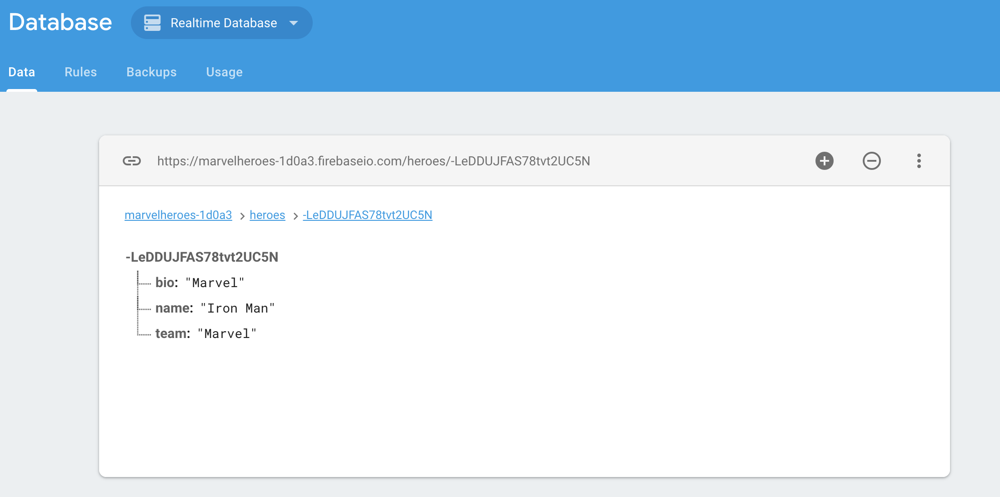
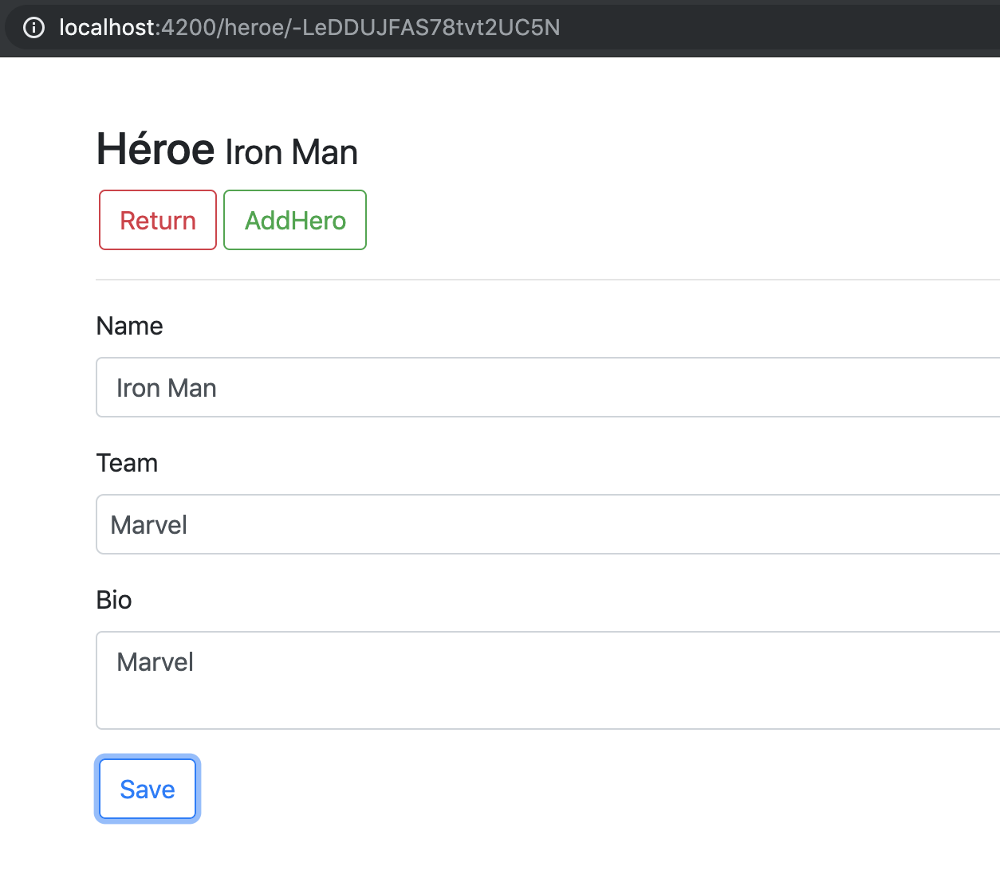
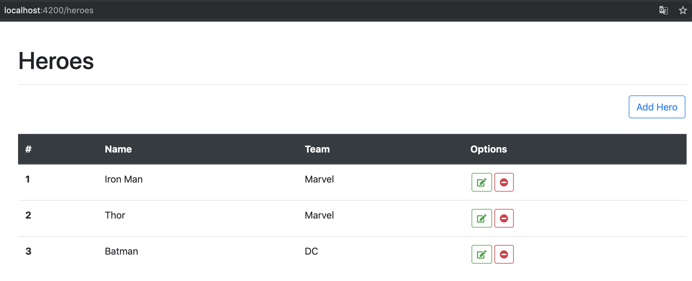

# Marvelheroes

This project was generated with [Angular CLI](https://github.com/angular/angular-cli) version 7.3.0.

## Development server

Run `ng serve` for a dev server. Navigate to `http://localhost:4200/`. The app will automatically reload if you change any of the source files.

## Code Images

This App used a service to connect Firebase such as Backend.

In Front-end, I used like (Service, Pipe, Router, Form).

Form

List 
